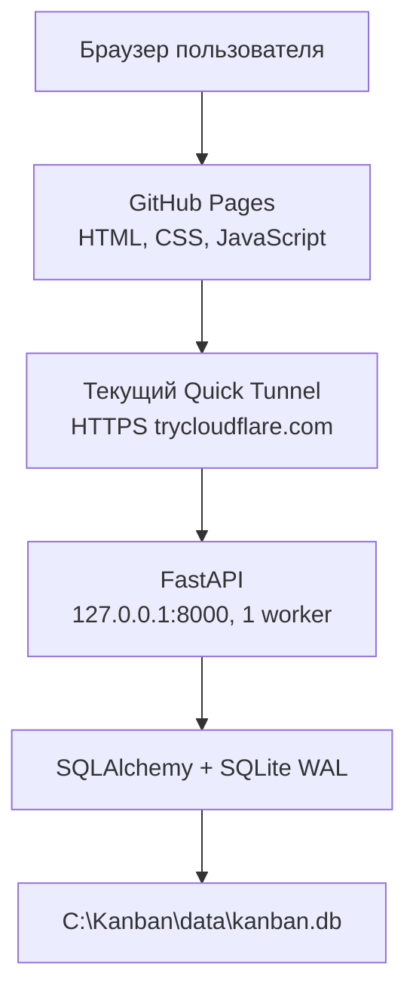
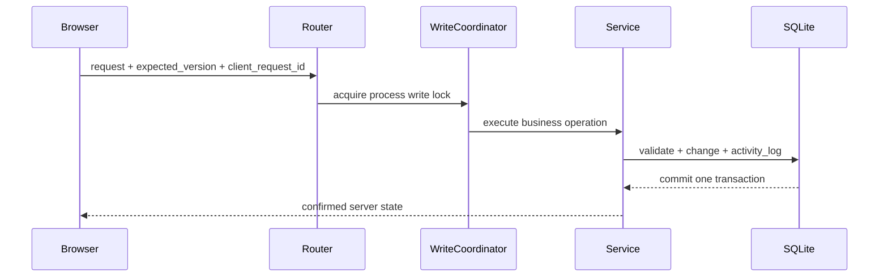

# Архитектура

## Общая схема



GitHub Pages хранит только статический интерфейс и `runtime-config.json`. Python, база,
технические логи, пароли и токены находятся на компьютере владельца.

## Backend

Backend — модульный монолит. HTTP-обработчики выполняют валидацию и вызывают сервисный слой;
транзакционная бизнес-логика находится в `service.py`.

| Модуль | Ответственность |
| --- | --- |
| `auth` | Argon2id, JWT, refresh rotation, logout, ограничение входа |
| `boards` | список, создание, snapshot, revision, архив |
| `columns` | колонки, порядок, WIP, безопасное удаление |
| `cards` | карточки, позиции, перемещение, архив |
| `activity` | атомарный предметный журнал и идемпотентность |
| `health` | liveness, ready, таблицы и Alembic revision |
| `users` | локальное административное управление |

Все внешние идентификаторы — UUID в строковом формате. Все даты на границе API имеют UTC.
Тип `UTCDateTime` компенсирует то, что SQLite сам не сохраняет сведения о часовом поясе.

## Мутация



`WriteCoordinator` — общий `threading.RLock` процесса. Он охватывает каждую запись, включая
проверку версии, WIP, пересчёт позиций, изменение сущности и `activity_log`. Чтения блокировку
не получают. Поэтому backend запускается только одним worker.

## Синхронизация

Каждая доска имеет:

- `revision` — меняется при любом содержательном изменении доски;
- `version` — оптимистическая версия самой доски.

Открытая вкладка читает только `/boards/{id}/revision` каждые 5 секунд; скрытая — каждые
20 секунд. Snapshot загружается только при новом `revision`. Во время drag-and-drop polling
откладывается до завершения операции.

Карточки и колонки также имеют `version`. При несовпадении `expected_version` backend отвечает
`409`, передаёт актуальную версию, а интерфейс загружает подтверждённый snapshot.

## Идемпотентность

Мутации принимают UUID `client_request_id`. Он сохраняется в уникальном поле
`activity_log.client_request_id` той же транзакцией. Повтор операции возвращает уже созданную
сущность и не создаёт дубликат. Повторное использование того же UUID для другого типа операции
возвращает `409 CLIENT_REQUEST_ID_REUSED`.

## Позиции

Позиции колонок и карточек — целые числа от нуля без пропусков в активном списке. Вставка,
перемещение, архивирование и удаление колонки пересчитывают затронутый список под общей
блокировкой. Сдвинутые сущности увеличивают `version`.

Удаление непустой колонки требует явного решения:

- перенести все карточки в другую активную колонку с проверкой WIP;
- архивировать карточки.

Молчаливого каскадного удаления нет.

## Авторизация

- Пароль: Argon2id, `m=65536`, `t=3`, `p=4`.
- Access JWT: 12 часов, хранится в памяти браузера и `sessionStorage`.
- Refresh JWT: 30 дней, хранится в `localStorage`; backend хранит только SHA-256 digest.
- Refresh ротационный: использованный токен сразу отзывается.
- Отключённый пользователь блокируется при каждом защищённом запросе.
- Неудачные входы ограничены по сочетанию IP + username: 10 попыток за 10 минут.
- Ролей owner/editor/viewer нет; любой активный пользователь видит все доски.

## SQLite

На каждом соединении задаются:

```sql
PRAGMA foreign_keys = ON;
PRAGMA journal_mode = WAL;
PRAGMA synchronous = NORMAL;
PRAGMA busy_timeout = 10000;
```

Схема изменяется только Alembic-миграциями. `ready` проверяет `SELECT 1`, обязательные таблицы
и ожидаемую Alembic revision.

## Переход на PostgreSQL

Хранилище следует пересмотреть, если наблюдается хотя бы один устойчивый признак:

- необработанные `database is locked`;
- 95-й перцентиль записи выше 1 секунды без внешней сети;
- очередь записи держится более 5 секунд;
- число пользователей или интенсивность мутаций превышают проверенный нагрузочный профиль.

Публичное API и frontend от типа базы не зависят. При миграции потребуется новый SQLAlchemy URL,
драйвер PostgreSQL и отдельная миграция данных.

## Логи

Технический лог: `C:\Kanban\logs\kanban-backend.log`, ротация 10 МБ × 10 архивов. Записываются
время, уровень, request_id, метод, путь, статус, длительность и тип ошибки. Пароли,
Authorization, access/refresh tokens, JWT secret и полные описания карточек не логируются.

Предметный `activity_log` является бизнес-данными и не удаляется ротацией логов.

